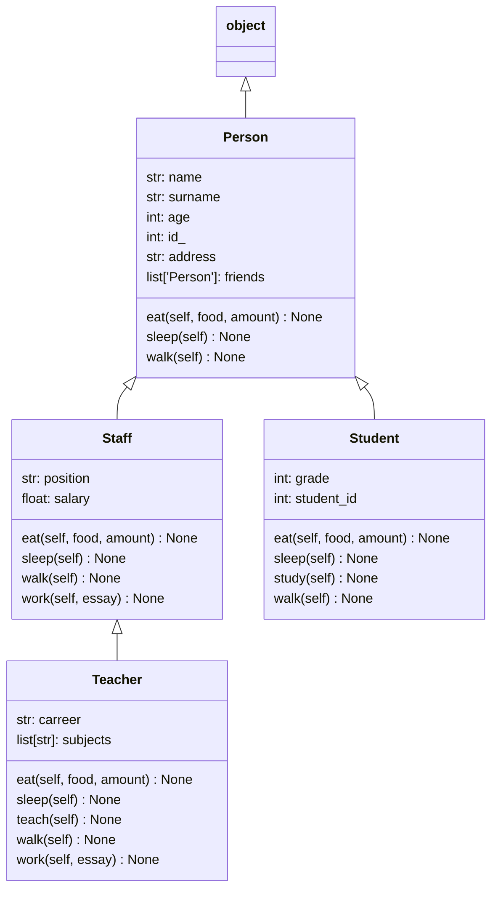

# Pymaid

Create Mermaid representations from python code.


## Example

This python code:

```py
class Person:
	name: str
	surname: str
	age: int
	id_: int
	address: str
	friends: list["Person"]

	def walk(self):
		...

	def eat(self, food, amount: int):
		...

	def sleep(self):
		...


class Student(Person):
	grade: int
	student_id: int

	def study(self):
		...


class Staff(Person):
	position: str
	salary: float

	def work(self, essay):
		...


class Teacher(Staff):
	carreer: str
	subjects: list[str]

	def teach(self):
		...
```

#### `pymaid file.py class` would generate the following mermaid class diagram:




Several command arguments are available for altering the generated diagram.