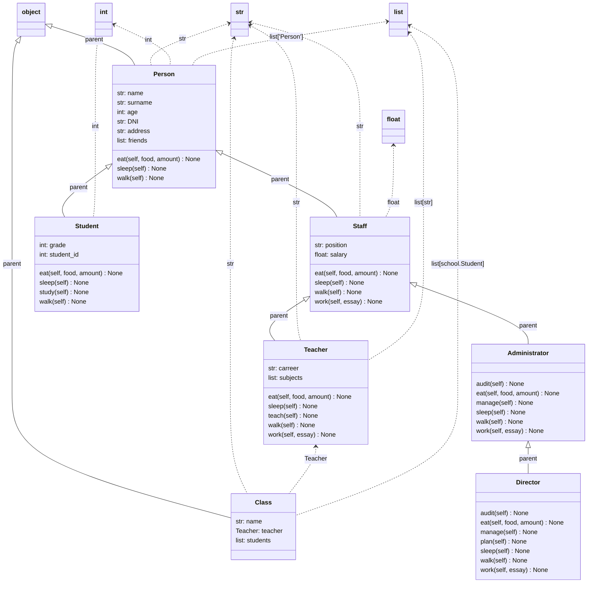

```mermaid
classDiagram
direction TB

class Administrator {
	audit(self) None
	eat(self, food, amount) None
	manage(self) None
	sleep(self) None
	walk(self) None
	work(self, essay) None
}
Staff <|-- Administrator: parent

class Class {
	str: name
	Teacher: teacher
	list: students
}
object <|-- Class: parent
str <.. Class: str
Teacher <.. Class: Teacher
list <.. Class: list[school.Student]

class Director {
	audit(self) None
	eat(self, food, amount) None
	manage(self) None
	plan(self) None
	sleep(self) None
	walk(self) None
	work(self, essay) None
}
Administrator <|-- Director: parent

class Person {
	str: name
	str: surname
	int: age
	str: DNI
	str: address
	list: friends
	eat(self, food, amount) None
	sleep(self) None
	walk(self) None
}
object <|-- Person: parent
str <.. Person: str
int <.. Person: int
list <.. Person: list['Person']

class Staff {
	str: position
	float: salary
	eat(self, food, amount) None
	sleep(self) None
	walk(self) None
	work(self, essay) None
}
Person <|-- Staff: parent
str <.. Staff: str
float <.. Staff: float

class Student {
	int: grade
	int: student_id
	eat(self, food, amount) None
	sleep(self) None
	study(self) None
	walk(self) None
}
Person <|-- Student: parent
int <.. Student: int

class Teacher {
	str: carreer
	list: subjects
	eat(self, food, amount) None
	sleep(self) None
	teach(self) None
	walk(self) None
	work(self, essay) None
}
Staff <|-- Teacher: parent
str <.. Teacher: str
list <.. Teacher: list[str]
```